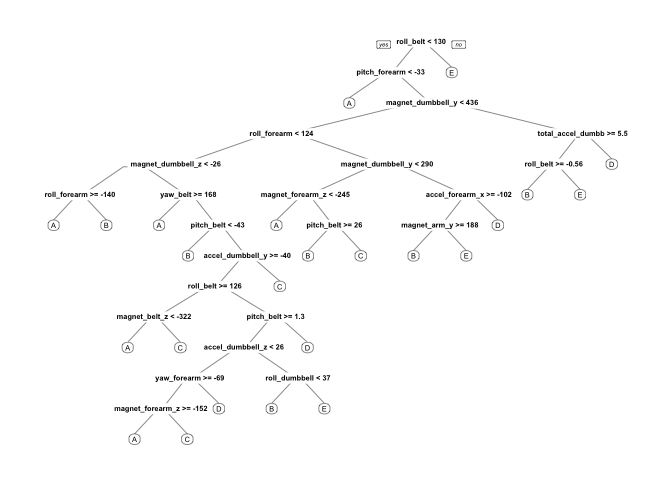
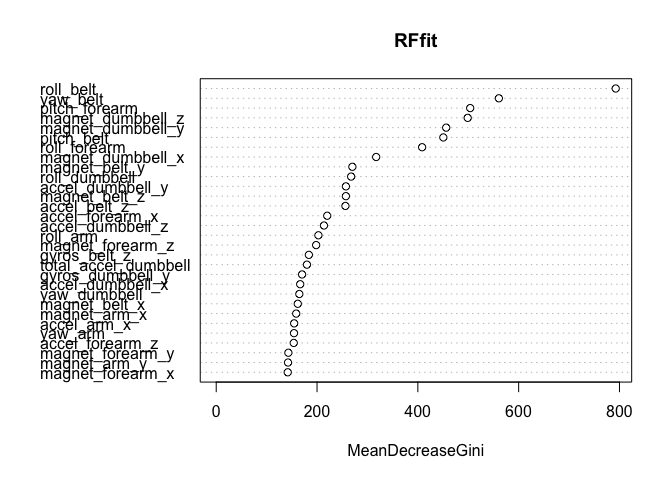
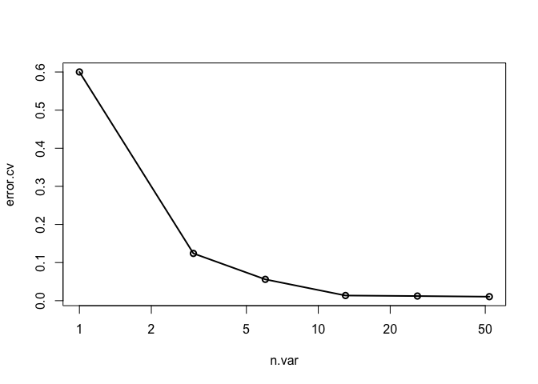

# Machine Learning Course Project
CA  
February 28, 2016  

# Executive Summary

In this report, a Random Forest model is utilized to classify the barbell-motion performed by test participants. The data contains various readings of sensors in addition to other information such as the participant or a time stamp as well as missing sensor readings. For that reason the data was cleaned before the analysis to avoid overfitting and/or fitting to wrong parameters (i.e. certain motion may have been performed at a certain time which could mis-lead the machine learner).

The out-of-sample accuracy of the model found was greater than 99%, so that we are confident that we have found a very accurate model. Based on the model, the 20 sensor sets of the test-set were predicted.

# Getting and Cleaning Data

First let's load some packages:


```r
# Loading Packages
setwd("~/Google Drive/DataScienceClasses/Machine Learning")
library(dplyr)
library(caret)
library(randomForest)
library(rpart)
library(rpart.plot)

# Setting seed for reproducibility
set.seed(4711)
```

Downloading and loading the data the data:


```r
if(!file.exists("train.csv")){
  download.file("https://d396qusza40orc.cloudfront.net/predmachlearn/pml-training.csv", "train.csv", method = "curl")
}

if(!file.exists("test.csv")){
  download.file("https://d396qusza40orc.cloudfront.net/predmachlearn/pml-testing.csv", "test.csv", method = "curl")
}

train <- read.csv("train.csv", na.strings = c("","NA","#DIV/0!"))
test <- read.csv("test.csv", na.strings = c("","NA","#DIV/0!"))
```

Looking at the train data, there are several columns that are mostly or only NAs, so essentially we cannot use them for prediction, hence we can remove them in both, training and test data. A cutoff was chosen to remove

Also the first couple of columns have data that might skew the prediction, like the timestamp or the username (i.e. certain excercises were only done at a certain time and/or by a certain user - while usually a valid classifier, the goal here is to identify the exercise purely based on the sensor readings rather than other patterns)


```r
# This takes care of the NA colums
remove <- apply(train, 2, function(x){mean(is.na(x))}) 
#levels(factor(removeNA))
remove <- remove > 0.9
# This takes care of the first 7 colums
remove[1:7] = TRUE

# Get rid of colums in test and training data
train <- train[,!remove]
test <- test[,!remove]
```

# Splitting the Data

Since we want to make sure to have a good classifier before we predict the test-set, we will split the training set into an in-sample and out-sample set at a 65/35 ratio.


```r
insamp <- createDataPartition(train$classe, p = 0.65, list = FALSE)

insTrain <- train[insamp, ]
outTrain <- train[-insamp, ]
```

# Model Fitting and Testing

## Classification and Regression Tree (CART)

In order to find the best prediction model, we will try a CARTree fit first, as this is a rather simple and very intuitive classification method. I prefer to use the function from the packages directly, rather than the caret-wrapper.


```r
# CARTree
CARTfit <- rpart(classe ~ ., data = insTrain)
rpart.plot(CARTfit)
```



```r
# CARTree
confusionMatrix(outTrain$classe, predict(CARTfit, outTrain, type = "class"))
```

```
## Confusion Matrix and Statistics
## 
##           Reference
## Prediction    A    B    C    D    E
##          A 1743   65   48   61   36
##          B  209  839  125   87   68
##          C   35  108  960   64   30
##          D   61  106  156  719   83
##          E   19  111  177   70  885
## 
## Overall Statistics
##                                           
##                Accuracy : 0.7496          
##                  95% CI : (0.7392, 0.7598)
##     No Information Rate : 0.3011          
##     P-Value [Acc > NIR] : < 2.2e-16       
##                                           
##                   Kappa : 0.6827          
##  Mcnemar's Test P-Value : < 2.2e-16       
## 
## Statistics by Class:
## 
##                      Class: A Class: B Class: C Class: D Class: E
## Sensitivity            0.8433   0.6827   0.6548   0.7183   0.8031
## Specificity            0.9562   0.9132   0.9561   0.9308   0.9346
## Pos Pred Value         0.8925   0.6318   0.8020   0.6391   0.7013
## Neg Pred Value         0.9340   0.9296   0.9107   0.9509   0.9613
## Prevalence             0.3011   0.1790   0.2135   0.1458   0.1605
## Detection Rate         0.2539   0.1222   0.1398   0.1047   0.1289
## Detection Prevalence   0.2845   0.1934   0.1744   0.1639   0.1838
## Balanced Accuracy      0.8997   0.7980   0.8055   0.8245   0.8688
```

A prediction accuracy of 75% is decent, but usually far better performance can be obtained by using Random Forests, which is an extension of CARTrees.

## Random Forest

Next let us examine the accuracy of fit of a Random Forest. The beauty of this approach is that it has a implicit boostrap (boostrap aggregation ["bagging"] as part of the methodology) and thus does not require any further cross-validation on the data. One can however perform cross-validation on the input parameters based on their importance (see below). 


```r
# Random Forest
RFfit <- randomForest(classe ~ ., data = insTrain, do.trace = F)

# Random Forest
confusionMatrix(outTrain$classe, predict(RFfit, outTrain))
```

```
## Confusion Matrix and Statistics
## 
##           Reference
## Prediction    A    B    C    D    E
##          A 1953    0    0    0    0
##          B    9 1318    1    0    0
##          C    0    9 1188    0    0
##          D    0    0    7 1117    1
##          E    0    0    0    4 1258
## 
## Overall Statistics
##                                           
##                Accuracy : 0.9955          
##                  95% CI : (0.9936, 0.9969)
##     No Information Rate : 0.2858          
##     P-Value [Acc > NIR] : < 2.2e-16       
##                                           
##                   Kappa : 0.9943          
##  Mcnemar's Test P-Value : NA              
## 
## Statistics by Class:
## 
##                      Class: A Class: B Class: C Class: D Class: E
## Sensitivity            0.9954   0.9932   0.9933   0.9964   0.9992
## Specificity            1.0000   0.9982   0.9984   0.9986   0.9993
## Pos Pred Value         1.0000   0.9925   0.9925   0.9929   0.9968
## Neg Pred Value         0.9982   0.9984   0.9986   0.9993   0.9998
## Prevalence             0.2858   0.1933   0.1742   0.1633   0.1834
## Detection Rate         0.2845   0.1920   0.1731   0.1627   0.1832
## Detection Prevalence   0.2845   0.1934   0.1744   0.1639   0.1838
## Balanced Accuracy      0.9977   0.9957   0.9959   0.9975   0.9992
```

An expected out-of-sample accuracy of 99.5% is a phenomenal result and requires no further tuning of the model.

### Cross-validation

A diagram of the input parameter importance is plotted below.


```r
varImpPlot(RFfit)
```



One can see that only a limited number of the variables have a huge contribution to the model. In the following we will cross-validate the parameters used with the `rfcv()` function built into the randomForest package. We will use 3 folds of the data.


```r
cvres <- rfcv(trainx = insTrain[,1:52], trainy = insTrain$classe, cv.fold = 3)
with(cvres, plot(n.var, error.cv, log="x", type="o", lwd=2))
```



The results show that further reduction of the number of parameters is possible. Using only the most important 26 instead of the 52 predictor variables would still yield a very accurate fit. Even at only 6 parameters, the model only produces an in-sample error of around 5%. This intuitively makes sense since some of the motions performed by the participants may have distint patterns in terms of basic acceleration, etc. Such acceleration would be recorded by various sensors used within and thus a high correlation will probably be found.

Further analysis of parameter correlation and potential reduction is highly advised, but was omitted here for now for the sake of keeping the analysis simple given the deadline approaching. For a production, model, such modification should be made, however.

# Model re-training for greatest accuracy

In order to optimize the model, the model will be re-fitted with the entirety of the training set so that the model has a maximum number of training sets. While not necessarily required at >99% accuracy, this may yield some additional performance.


```r
RFfit_fin <- randomForest(classe ~ ., data = train, do.trace = F)
```

# Predicting on the test set for submission

With the final model fitted, we can now predict the test-set with the 20 observations we were given:


```r
prediction <- predict(RFfit_fin, test)
print(data.frame(id = test$problem_id, prediction))
```

```
##    id prediction
## 1   1          B
## 2   2          A
## 3   3          B
## 4   4          A
## 5   5          A
## 6   6          E
## 7   7          D
## 8   8          B
## 9   9          A
## 10 10          A
## 11 11          B
## 12 12          C
## 13 13          B
## 14 14          A
## 15 15          E
## 16 16          E
## 17 17          A
## 18 18          B
## 19 19          B
## 20 20          B
```

(All test-cases were correct according to the Coursera platform.)

# Session Info for full Reproducibility


```r
sessionInfo()
```

```
## R version 3.2.3 (2015-12-10)
## Platform: x86_64-apple-darwin13.4.0 (64-bit)
## Running under: OS X 10.11.3 (El Capitan)
## 
## locale:
## [1] en_US.UTF-8/en_US.UTF-8/en_US.UTF-8/C/en_US.UTF-8/en_US.UTF-8
## 
## attached base packages:
## [1] stats     graphics  grDevices utils     datasets  methods   base     
## 
## other attached packages:
## [1] rpart.plot_1.5.3    rpart_4.1-10        randomForest_4.6-12
## [4] caret_6.0-64        ggplot2_2.0.0       lattice_0.20-33    
## [7] dplyr_0.4.3        
## 
## loaded via a namespace (and not attached):
##  [1] Rcpp_0.12.3        formatR_1.2.1      nloptr_1.0.4      
##  [4] plyr_1.8.3         class_7.3-14       iterators_1.0.8   
##  [7] tools_3.2.3        digest_0.6.9       lme4_1.1-11       
## [10] evaluate_0.8       gtable_0.1.2       nlme_3.1-124      
## [13] mgcv_1.8-11        Matrix_1.2-3       foreach_1.4.3     
## [16] DBI_0.3.1          yaml_2.1.13        parallel_3.2.3    
## [19] SparseM_1.7        e1071_1.6-7        stringr_1.0.0     
## [22] knitr_1.12.3       MatrixModels_0.4-1 stats4_3.2.3      
## [25] grid_3.2.3         nnet_7.3-12        R6_2.1.2          
## [28] rmarkdown_0.9.2    minqa_1.2.4        reshape2_1.4.1    
## [31] car_2.1-1          magrittr_1.5       scales_0.3.0      
## [34] codetools_0.2-14   htmltools_0.3      MASS_7.3-45       
## [37] splines_3.2.3      assertthat_0.1     pbkrtest_0.4-6    
## [40] colorspace_1.2-6   quantreg_5.19      stringi_1.0-1     
## [43] munsell_0.4.3
```


